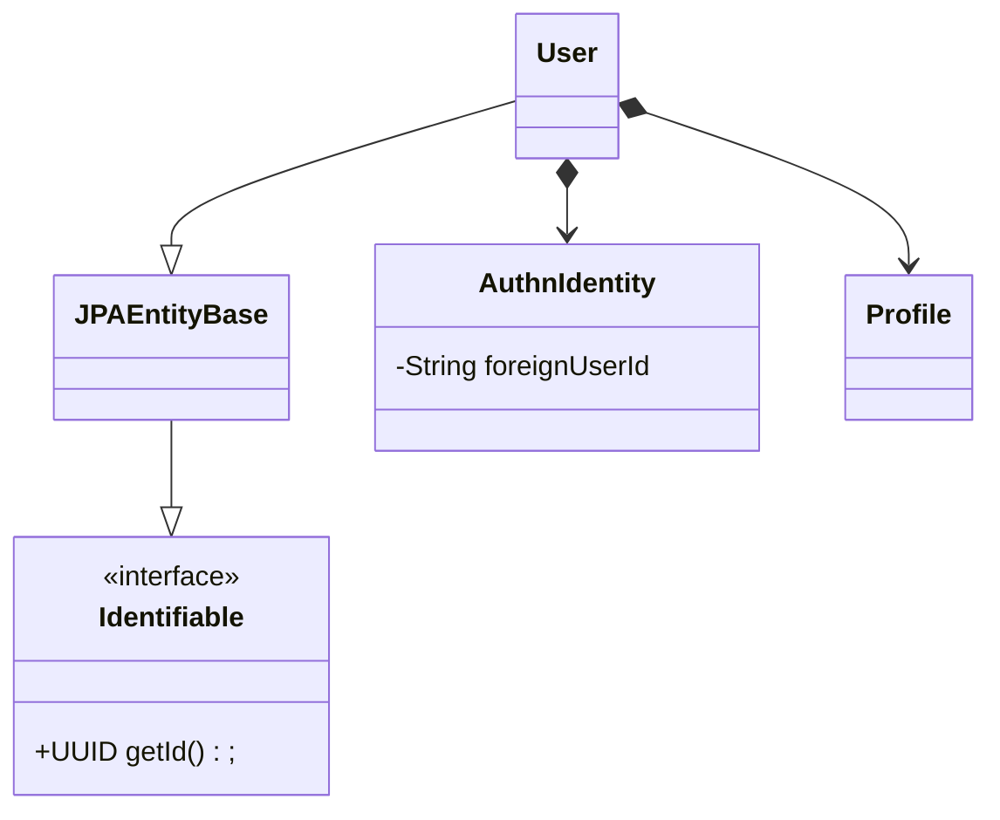
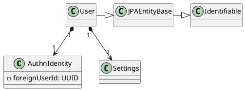

# Installation
## Code

build and run tests.
```shell
./gradlew build
```
## Browser
### Mermaid

Install the chrome extension for
[Mermaid](https://chrome.google.com/webstore/detail/mermaid-diagrams/phfcghedmopjadpojhmmaffjmfiakfil)
to view documentation correctly.

# Domain Model
## User




```
@startuml
skinparam monochrome true

interface Identifiable {
   +getId() : UUID
}

abstract JPAEntityBase
@enduml
```




