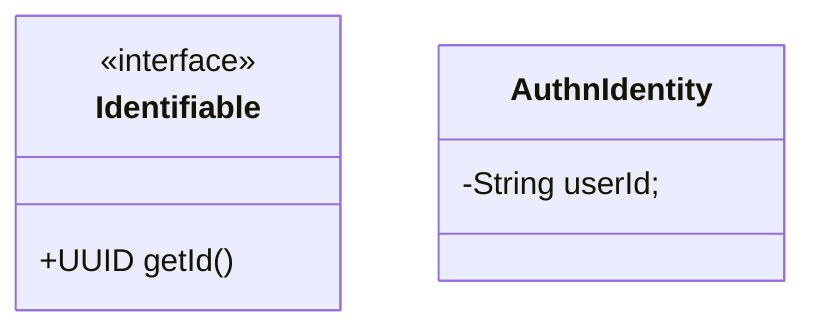

# Build

build and run tests.
```shell
./gradlew build
```

# Domain Model
## User


```mermaid
graph TD;
    A-->B;
    A-->C;
    B-->D;
    C-->D;
```


```mermaid
classDiagram
    class Identifiable {
        <<interface>>
        +UUID getId()
    }

    class AuthnIdentity {
        -String userId;
    }
```
